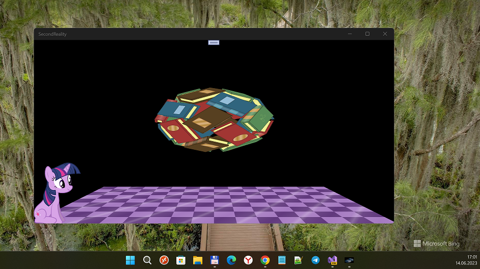
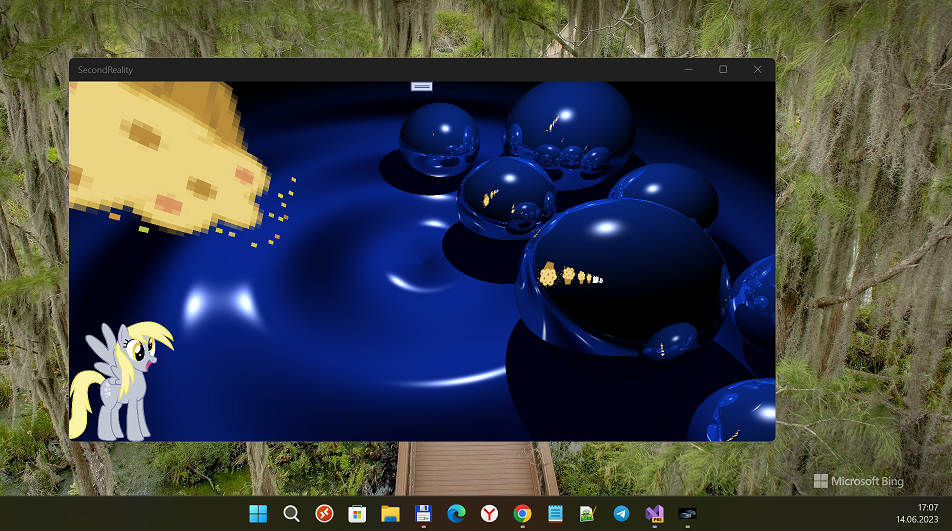

# SecondReality fun remake ("Realipony" codename)

I started my small experiment of running Eric Mooneys' remake of Second Reality (WinRT edition). 

The goal was Win10/11 Desktop-compatible UWP app (or even W10M-compatible app... who knows?).

And, SecondReality is Coolest Demoscene theme. So, have fun! :)

## Screenshots

## GameTech I used
- I assembled and used my own "UAP 15063-compatible" Monogame (& SharpDX) "framework" as "graphics backend". 
- XNA Content is "included" (precompiled) with project! 

## Main changes / Progress (+/-)
- Microsoft.XNA framework -> Monogame XNA framework (?)
- Xna.VideoPlayer -> Windows.UI.Xaml.Controls.MediaElement + 
- Monogame XNA Content Pipeline fight (?)
- System.Threading.Thread -> System.Threading.Tasks.Task +

Original project is here: https://github.com/erikmooney/SecondRealipony

## How to build the code / assemble this solution
- Should compile nicely with Visual Studio 2022 Preview Community for Windows 10/11. 
- Find and download MonoGame3_6_Setup.exe (from offical monogame.net site , etc.) 
and install it *before* the secondreality building.

## Reference(s)
- https://github.com/noxo/SecondRealityponyWinRT

## ..
As is. No support. RnD only. DIY

## .
[m][e] 2023
