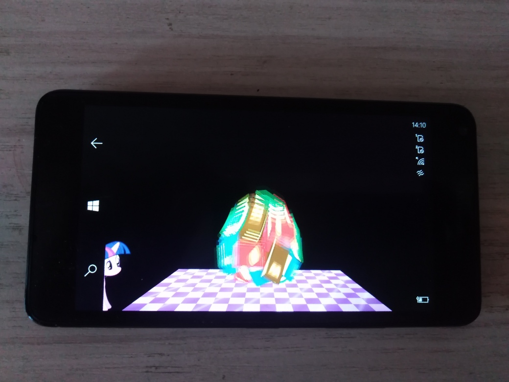

# SecondReality 1.0.4 ("Realipony" codename)

I started research as my small experiment of running Eric Mooneys' remake of Second Reality 
[WinRT edition](https://github.com/noxo/SecondRealityponyWinRT)... and, in result, 
I assembled this fun UWP app... ;) 

The goal was Win10/11 Desktop-compatible UWP app (and even W10M-compatible app), because of Second Reality is [c]oolest [d]emoscene !

## Screenshots

## GameTech I used
- I decided to use firm Monogame 3.8 engine as "game graphic renderer". 
- XNA Content is "included" (precompiled) with project! 

## Main changes / Progress (+/-)
- Microsoft.XNA framework -> Monogame XNA framework +
- Xna.VideoPlayer -> Windows.UI.Xaml.Controls.MediaElement + 
- Monogame XNA Content Pipeline fight - not needed :)
- System.Threading.Thread -> System.Threading.Tasks.Task +
- Min. Win. OS build (SDK) = 10240
- Tested targets: x64, ARM32
- Demo-scene performance increased (improved) a little :)

## How to build the code / assemble this solution
- Should compile nicely with Visual Studio 2022 Preview Community for Windows 10/11. 
- Find and download MonoGame3_6_Setup.exe (from offical monogame.net site , etc.) 
and install it *before* the secondreality building.

## Known bugs
- When this app reaches the end and tried to exit at Lumia 950, phone hangs / freezes :( Soft reboot needed (hold power button more than 10 sec., and the device will restart...)

## References
- https://github.com/noxo/SecondRealityponyWinRT Original SecondRealityponyWinRT project
- https://github.com/noxo noxo, SecondRealityponyWinRT C# Developer

## ..
As is. No support. RnD only. DIY

## .
[m][e] 2024
